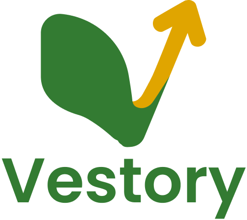

<div align="center">

  

  **Vestory is a gamified stock investment application designed to help users learn and practice investing through engaging missions and simulated market data.**

   <p align="center">
    
    
    
  </p>

  <br />

  
  

</div>

---

## Table of contents

- Vestory
  - [Table of contents](#table-of-contents)
  - [Project overview](#project-overview)
  - [Key features](#key-features)
  - [Technology stack](#technology-stack)
  - [Project structure](#project-structure)
  - [Getting Started](#getting-started)
    - [Prerequisites](#prerequisites)
    - [Installation](#installation)
  - [Team](#team)

## Project overview

| Item             | Details            |
| ---------------- | ------------------ |
| Application Type | Mobile Application |
| Primary Platform | Android / iOS      |

Vestory bridges the gap between financial literacy and practical investment experience. By combining simulated stock market data tracking with a gamified mission system, Vestory encourages users to actively participate in the stock market. Users are rewarded for achieving investment milestones, making learning both fun and financially rewarding.

## Key features

| Feature                   | What the user can do                                                               |
| ------------------------- | ---------------------------------------------------------------------------------- |
| **Gamified Missions**     | Complete structured investment challenges to earn rewards and track progress.      |
| **Stock Market Explorer** | Search and view simulated data of various market stocks with debounced search.     |
| **Portfolio Management**  | Track total equity, profits, and losses of personal investments.                   |
| **In-App Notifications**  | Receive automatic notifications upon completing missions and achieving milestones. |


## Technology stack

| Category         | Technology     | Purpose                                                                                          |
| ---------------- | -------------- | ------------------------------------------------------------------------------------------------ |
| Frontend         | Flutter & Dart | Core framework for building the cross-platform mobile application.                               |
| Architecture     | Feature-based  | Ensures separation of concerns by grouping code by features.                                     |
| State Management | Riverpod       | Manages application state, dependency injection, and reactivity.                                 |
| Database         | Drift (SQLite) | Provides robust, type-safe local data persistence for missions, notifications, and transactions. |
| Routing          | GoRouter       | Handles declarative routing and deep linking across the application.                             |


## Project structure

```bash
├── lib/
│   ├── app/                    # Core application setup
│   │   ├── config/             # App-wide configs (e.g., router.dart for GoRouter)
│   │   └── app.dart            # Main App widget configuration
│   ├── core/                   # Core components
│   │   ├── constants/          # Global constants (e.g., app_constants.dart)
│   │   ├── database/           # Drift SQLite Implementation
│   │   │   ├── connection/     # Platform-specific DB connections (web, native)
│   │   │   ├── daos/           # Data Access Objects for database queries
│   │   │   └── tables/         # Database schema definitions
│   │   ├── providers/          # Global core state providers
│   │   ├── theme/              # Application styling (e.g., app_colors.dart)
│   │   └── utils/              # Helper utilities (currency format, debouncer)
│   ├── features/               # Feature modules (Feature-First Architecture)
│   │   ├── home/               # Home dashboard UI
│   │   ├── mission/            # Gamified mission logic, UI, and data
│   │   ├── notification/       # Notification history UI and provider
│   │   ├── onboarding/         # Welcome screens
│   │   ├── portfolio/          # Investment portfolio tracking
│   │   ├── search/             # Stock market search and debouncing
│   │   ├── settings/           # User preferences and app settings
│   │   └── stock/              # Stock detail and market data
│   ├── shared/                 # Shared code used across multiple features
│   │   ├── data/               # Global repositories and models
│   │   └── presentation/       # Reusable UI widgets and layouts
│   ├── bootstrap.dart          # Bootstrap application
│   └── main.dart               # Entry point of the application
├── assets/                     # Local images and static assets
└── pubspec.yaml                # Project dependencies and configurations
```

## Getting Started

To get a local copy up and running, follow these simple steps.

### Prerequisites

*   Flutter SDK (>=3.10.0 <4.0.0) installed on your machine.
*   An editor like VS Code or Android Studio.

### Installation

1.  **Clone the repo**
    ```sh
    git clone https://github.com/dirgaydtm/vestory
    ```
2.  **Navigate to the project directory**
    ```sh
    cd vestory
    ```
3.  **Install dependencies**
    ```sh
    flutter pub get
    ```
4.  **Run Code Generation (Drift)**
    ```sh
    dart run build_runner build --delete-conflicting-outputs
    ```
5.  **Run the app**
    ```sh
    flutter run
    ```

---

## Team

| Name                 | Role            | Responsibilities                                                                                    | Contact                                                                                          |
| -------------------- | --------------- | --------------------------------------------------------------------------------------------------- | ------------------------------------------------------------------------------------------------ |
| Mahfuzhah P. Sistana | Product Manager | Oversees product roadmap, backlog, and ensures features align with user needs.                      | [LinkedIn](https://www.linkedin.com/in/mahfuzhahpsistana) • [GitHub](https://github.com/Sistana) |
| Mikko Ermano Liu     | UI/UX Designer  | Designs application wireframes, high-fidelity mockups, and user flows.                              | [LinkedIn](https://www.linkedin.com/in/mikko-liu) • [GitHub](https://github.com/mxntko)          |
| Dirga                | Mobile Engineer | Architected the Flutter application, implemented gamified missions, Drift database, and UI slicing. | [LinkedIn](https://www.linkedin.com/in/dirgaydtm) • [GitHub](https://github.com/dirgaydtm)       |
